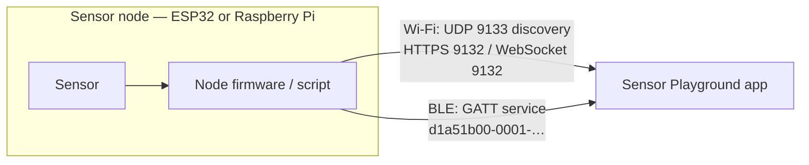

# Sensor Playground — Node Firmware & Scripts

Companion firmware for the **Sensor Playground** app: ready-to-flash Arduino
sketches for the **ESP32** and equivalent Python scripts for **Raspberry Pi**
class single-board computers, turning a sensor and a board into a node the app
discovers and reads over your own network — no cloud, no account.

<!-- TODO: replace the Apple id below once the app is live in App Store Connect. -->
[](https://play.google.com/store/apps/details?id=app.flutterdev.sensortester)
[](https://apps.apple.com/app/sensor-playground/id0000000000)
[](LICENSE)

> The store links above are **placeholders** and do not resolve yet.

Every supported sensor exists in **two parallel implementations** — one Arduino
sketch, one Python script — that speak the identical wire protocol. The app
cannot tell them apart, so you can start on an ESP32 and move the same sensor to
a Raspberry Pi (or the reverse) without touching the app.

---

## Contents

- [How it works](#how-it-works)
- [Supported sensors](#supported-sensors)
- [Repository layout](#repository-layout)
- [Quick start — ESP32](#quick-start--esp32)
- [Quick start — Raspberry Pi / SBC](#quick-start--raspberry-pi--sbc)
- [Transports](#transports)
- [Protocol reference](#protocol-reference)
- [Security notes](#security-notes)
- [Troubleshooting](#troubleshooting)

---

## How it works

A node advertises itself, the app finds it, and readings flow. Which path a node
takes depends on its transport, chosen at build time (ESP32) or in
`config.json` (Python).



Nodes come in five flavours, and the app opens a different screen for each:

| Kind | Behaviour | Sensors |
|------|-----------|---------|
| **Pollable** | App requests a reading (HTTPS every 3 s, or BLE read/notify at 1 Hz) | Environment, light, optical, GPS |
| **Streaming** | Node pushes continuously (WebSocket or BLE notify, every 250 ms) | IMU 10DOF, MMA7660, MPU6050 |
| **Event push** | Node sends one message per event | PAJ7620 gesture, VL53L0X distance, contact sensors, rotary angle |
| **Display** | Reverse direction — the **app** sends bitmaps to the node | SSD1306 OLED |
| **Actuator** | Both directions — the app switches it, the node reports the result | LED (+ optional local button) |

The Python sensor nodes additionally support an **emulation mode**
(`"emulation": true` in `config.json`) that generates plausible readings with no
hardware attached, so you can exercise the app before wiring anything up.

---

## Supported sensors

24 sensors and one display, each available for both platforms.

### Environment & air quality

| Sensor | Measures | Bus |
|--------|----------|-----|
| BME680 | Temperature, humidity, pressure, IAQ | I²C |
| BME280 | Temperature, humidity, pressure | I²C |
| BMP085 / BMP180 | Temperature, pressure, derived altitude | I²C |
| SCD30 | Temperature, humidity, CO₂ (NDIR) | I²C |
| SGP30 | eCO₂, TVOC | I²C |
| CozIR-A | Temperature, humidity, CO₂ | Serial |
| SHT31 / SHT41 | Temperature, humidity | I²C |
| AHT10 / AHT20 | Temperature, humidity | I²C |
| MCP9808 | Temperature (high accuracy) | I²C |
| MLX90615 | Object + ambient temperature (non-contact IR) | I²C |

### Light & optical

| Sensor | Measures | Bus |
|--------|----------|-----|
| SI1145 | Visible light, infrared, UV index | I²C |
| TSL2591 | Visible light, infrared, illuminance (lux) | I²C |
| TCS34725 | RGB colour, colour temperature, illuminance | I²C |
| Grove Light Sensor | Brightness (raw) | Analog |

### Motion, orientation & position

| Sensor | Measures | Bus |
|--------|----------|-----|
| IMU 10DOF (MPU9250 + BMP280) | Roll, pitch, heading, g-force, temperature, pressure | I²C |
| MPU6050 | Roll, pitch, g-force, temperature | I²C |
| MMA7660 | Roll, pitch, g-force | I²C |
| Air530 | Latitude, longitude, altitude, satellites (NMEA) | Serial |

### Event-driven

| Sensor | Reports | Bus |
|--------|---------|-----|
| PAJ7620 | Hand gestures (9 basic) | I²C |
| VL53L0X | Distance (time-of-flight laser) | I²C |
| Button, Hall, Magnetic switch, PIR, Vibration, Line Finder | Active / inactive | Digital |
| Grove Rotary Angle Sensor | Knob position (raw ADC + angle) | Analog |

The six digital contact sensors share **one** node — set `SENSOR_NAME` and
`ACTIVE_LOW` (sketch) or `sensor_name` and `active_low` (`config.json`).
The Line Finder is an infrared reflectance detector that sees a dark line
against a bright surface; its output polarity differs between board revisions,
so check it against the app and flip the active-low flag if the two states come
out swapped.

The rotary angle sensor pushes its **ADC full-scale value with every reading**
(`adcMax`), because the converter's width belongs to the board and not to the
knob: 12-bit `0–4095` on an ESP32 or a Grove Base Hat, 10-bit `0–1023` on a
NanoHat Hub or a GrovePi+. The app scales its dial by what the node reports
rather than assuming one of them.

### Display

| Device | Accepts | Bus |
|--------|---------|-----|
| SSD1306 128×64 OLED | Monochrome bitmaps, clear command | I²C |

### Actuator

| Device | Accepts | Reports | Bus |
|--------|---------|---------|-----|
| LED | On, off, toggle | Its current state | Digital |

The only two-way node: the app switches the LED and the node reports the
resulting state back, so an optional push button wired to the same node shows
up in the app as well.

---

## Repository layout

```
esp32/                     Arduino sketches (one folder per sensor)
  esp32_<sensor>/
    esp32_<sensor>.ino     The sketch — both transports in one file
    secrets.h.example      Wi-Fi credentials, API key, TLS cert
    README.md              Wiring, libraries, testing
  generate_cert.sh         Creates a self-signed cert and writes it to secrets.h
  CameraWebServer/         Standalone ESP32-CAM streamer (not part of the app)

python/                    Python nodes (one folder per sensor)
  <sensor>/
    sensor_node.py         The node
    config.example.json    API key, transport, bus/pin settings
    requirements.txt
    README.md              Wiring, setup, testing
  common/                  Shared BLE GATT transport used by every node
  extension_hat/           Grove / BakeBit hat helper (not a node)
```

Each node folder has its own README with wiring diagrams, dependencies and test
commands. Start there for the sensor you actually own.

---

## Quick start — ESP32

**Prerequisites:** Arduino IDE (or `arduino-cli`) with the ESP32 board package,
plus `ArduinoJson` and the per-sensor driver libraries listed in the sketch
header.

```bash
cd esp32/esp32_bme680
cp secrets.h.example secrets.h
```

Edit `secrets.h` — Wi-Fi SSID/password, an API key of at least 8 characters, and
a hostname. For the Wi-Fi transport, generate the TLS certificate:

```bash
../generate_cert.sh          # writes SERVER_CERT / SERVER_KEY into secrets.h
```

Pick the transport at the top of the sketch:

```c
#define ACTIVE_TRANSPORT TRANSPORT_BLE     // or TRANSPORT_WIFI
```

Flash it, open the Serial Monitor at 115200 baud, and the node reports its IP
(Wi-Fi) or that it is advertising (BLE). Then scan from the app.

> **Flash usage:** BLE builds land around 84–87 % of the default partition. If
> you extend a sketch and run out of space, choose
> *Tools → Partition Scheme → Huge APP*.

Build both variants from the command line without editing the file:

```bash
arduino-cli compile --fqbn esp32:esp32:esp32 esp32_bme680 \
  --build-property "compiler.cpp.extra_flags=-DACTIVE_TRANSPORT=1"   # 0 = Wi-Fi
```

---

## Quick start — Raspberry Pi / SBC

**Prerequisites:** Python 3, I²C enabled (`sudo raspi-config` → Interface
Options → I2C). Some sensors need `python3-dev` and `build-essential` for their
Adafruit driver dependencies — the per-node README says which. Nodes that read
a GPIO directly (`digital_contact`) additionally need the venv created with
`--system-site-packages`, so gpiozero can find the system `python3-lgpio`
backend.

```bash
cd python/bme680
python3 -m venv venv
source venv/bin/activate
pip install -r requirements.txt

cp config.example.json config.json
```

Edit `config.json`:

```json
{
  "api_key": "your-sensor-api-key",
  "transport": "wifi",
  "i2c_bus": 1,
  "emulation": false
}
```

For the Wi-Fi transport, generate a certificate in the node folder:

```bash
openssl req -x509 -nodes -days 3650 -newkey rsa:2048 \
  -keyout key.pem -out cert.pem -subj "/CN=SensorPlayground"
```

Run it:

```bash
python3 sensor_node.py
```

**Board I²C buses:** Raspberry Pi `1` (default), NanoPi (Armbian) `0`, Banana Pi
(Armbian) `2`. Sensors wired through a Grove/BakeBit hat use the
[`extension_hat`](python/extension_hat/) helper instead of a direct bus.

### BLE on Linux

The BLE transport uses [bless](https://github.com/kevincar/bless) over BlueZ and
needs a little more setup — see [`python/common/README.md`](python/common/README.md).
In short:

- Copy the `common/` folder next to the node folder when deploying.
- Only **one** BLE node can run per board.
- On Raspberry Pi OS the node must run as **root**: current Pi kernels reject
  the advertising command BlueZ sends, so the transport falls back to driving
  the kernel management socket directly, which needs `CAP_NET_ADMIN`.
- If Bluetooth will not power on, check `rfkill list bluetooth`.

---

## Transports

Both transports carry the same JSON payloads; pick whichever suits the
deployment. A node uses one at a time.

| | **Wi-Fi** | **Bluetooth LE** |
|---|---|---|
| Discovery | UDP broadcast, port 9133 | BLE advertising |
| Data | HTTPS REST or WebSocket, port 9132 | GATT service |
| Auth | `X-Api-Key` header | API key written to the auth characteristic |
| Encryption | TLS (self-signed) — `ws://` for push nodes | BLE link layer |
| Range | LAN | ~10 m |
| Setup | Certificate + credentials | None |

---

## Protocol reference

### UDP discovery (Wi-Fi)

The app broadcasts `SENSOR_TESTER` on port 9133. Nodes reply with their
identity, plus a short-key preview of the current reading for pollable sensors:

```json
{"type":"BME680","host":"raspberrypi","ip":"192.168.1.42","port":9132,"temp":22.4}
```

### HTTPS REST (pollable Wi-Fi nodes)

`GET https://<ip>:9132/` with an `X-Api-Key` header:

```json
{"sensor":"BME680","host":"raspberrypi","temperature":22.4,"humidity":41.8,"pressure":1013.2,"iaq":63}
```

Returns `401` without a valid key. A failed sensor read returns `503` — except
GPS, where "no fix yet" is a normal warm-up state and the node returns `200`
with a metadata-only body so the app can show a *waiting for satellite fix*
screen.

### WebSocket (streaming, event and display Wi-Fi nodes)

`ws://<ip>:9132`, with the API key checked on the handshake. The node pushes one
JSON message per event or interval:

```json
{"gesture":"forward"}
{"active":true}
{"sensor":"MPU6050","host":"esp32","roll":8.1,"pitch":-3.2,"gforce":1.01}
```

### BLE GATT

| Attribute | UUID | Properties |
|-----------|------|------------|
| Service | `d1a51b00-0001-4a7e-9b3c-0a1b2c3d4e5f` | Advertised under the sensor name |
| Data | `d1a51b00-0002-4a7e-9b3c-0a1b2c3d4e5f` | Read, Notify — UTF-8 JSON |
| Auth | `d1a51b00-0003-4a7e-9b3c-0a1b2c3d4e5f` | Write — plain API key |
| Command | `d1a51b00-0004-4a7e-9b3c-0a1b2c3d4e5f` | Write — display nodes only |

Flow: connect → write the API key to the auth characteristic → read or subscribe
to the data characteristic. Reads return `{}` until authenticated, and a
disconnect clears the authentication. Notifications run at 1 Hz for pollable
sensors, 250 ms for the motion sensors, and per event for push nodes.

The payload commonly exceeds the default 23-byte ATT MTU, so clients should
request a larger one (the app asks for 512).

#### Display command channel

A 1024-byte frame does not fit in a single ATT write, so the app sends the
bitmap as raw binary chunks — no base64, since BLE writes are binary-safe —
followed by a show command:

| Packet | Effect |
|--------|--------|
| `0x01 <offset:u16 big-endian> <bytes…>` | Stage a chunk at `offset` |
| `0x02` | Draw the staged frame |
| `0x03` | Blank the display |

Chunks must arrive contiguously; writing offset 0 restarts the frame, and a
show on an incomplete frame is refused rather than drawn.

---

## Security notes

This firmware is built for a **trusted home network**, and the trade-offs are
deliberate:

- **Secrets stay local.** `secrets.h` (ESP32) and `config.json` (Python) hold
  your credentials and are git-ignored — copy the `.example` files and edit
  those. Certificates (`*.pem`) are ignored too.
- **TLS is self-signed.** Pollable Wi-Fi nodes serve HTTPS with a certificate
  you generate, which the app accepts without CA validation. That protects
  against passive sniffing, not against an active attacker on your LAN.
- **Push nodes use plaintext `ws://`,** not `wss://` — an ESP32 cannot
  comfortably terminate TLS on a long-lived socket at these rates. The API key
  is checked on the handshake.
- **The API key is a shared secret,** sent as a header (Wi-Fi) or written to a
  characteristic (BLE). Use at least 8 characters and do not reuse a password.

Do not expose a node directly to the internet.

---

## Troubleshooting

**The app does not find my node.**
Check that phone and node are on the same subnet and that the network permits
UDP broadcast — client isolation on guest Wi-Fi blocks discovery. For BLE,
confirm only one BLE node is running per board.

**"Check API key or network" in the app.**
The key in the app settings must match `API_KEY` / `api_key` on the node
exactly. On Wi-Fi, confirm the node prints its IP and that `cert.pem`/`key.pem`
exist.

**Readings look wrong or frozen.**
Verify the sensor is detected on the bus (`i2cdetect -y 1` on a Pi) and that
`i2c_bus` matches your board. The Serial Monitor / console logs every reading.

**BLE advertising fails on a Raspberry Pi.**
Expected on current Pi kernels — run the node as root so it can use the
fallback advertiser. See [`python/common/README.md`](python/common/README.md).

---

## Contributing

Issues and pull requests are welcome — especially new sensors. A new node should
ship both implementations (sketch + Python script) speaking the same protocol, a
README with wiring, an emulation mode, and support for both transports.

## Licence

[MIT](LICENSE) © 2026 Peter Sauer. The individual driver libraries, and the
Grove / [dart_periphery](https://github.com/pezi/dart_periphery) drivers some
nodes are ported from, keep their own licences.
